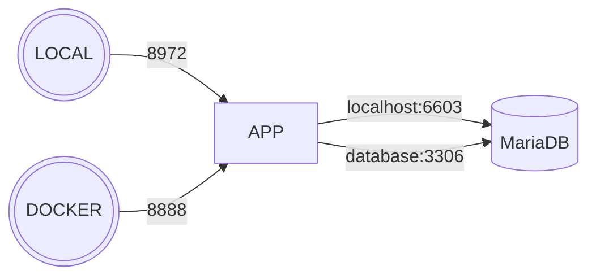
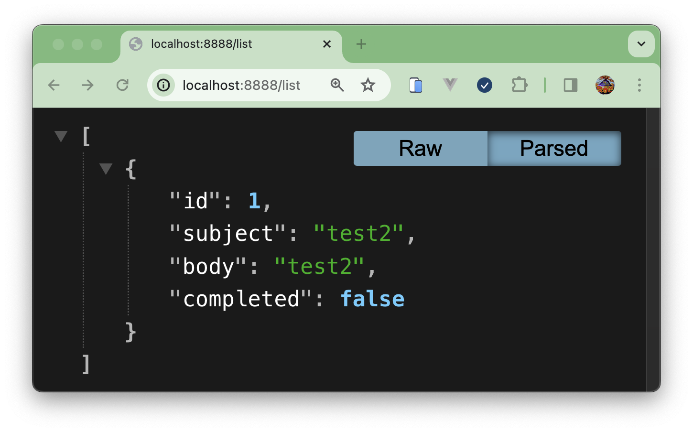

# SpringBoot MyBartis3 MariaDB Sample

- java 17
- springboot 3.1.10
- mybatis 3.0.3
- 11.3.2-MariaDB-1:11.3.2+maria~ubu2204

## Structure


## RUN
- docker compose - http://localhost:8888/list
```bash
# Disabled / build -> auto multi-stage build!
# $ ./gradlew clean bootJar

$ docker compose up -d --force-recreate --build --renew-anon-volumes
```


- local - http://localhost:8972/list
```
$ ./graclew clean bootRun
```

## Check Telnet
```
# 접속
$ docker exec -it todo-container sh

# 리눅스 종류/버전 확인
$ / # cat /etc/os-release
NAME="Alpine Linux"
ID=alpine
VERSION_ID=3.14.0
PRETTY_NAME="Alpine Linux v3.14"
HOME_URL="https://alpinelinux.org/"
BUG_REPORT_URL="https://bugs.alpinelinux.org/"

# Alpine Linux 에 telnet 설치
/ # apk add busybox-extras
fetch https://dl-cdn.alpinelinux.org/alpine/v3.14/main/x86_64/APKINDEX.tar.gz
fetch https://dl-cdn.alpinelinux.org/alpine/v3.14/community/x86_64/APKINDEX.tar.gz
(1/1) Installing busybox-extras (1.33.1-r8)
Executing busybox-extras-1.33.1-r8.post-install
Executing busybox-1.33.1-r2.trigger
OK: 8 MiB in 21 packages

# localhost 3306 접근 가능 테스트 -> 불가
/ # busybox-extras telnet localhost 3306
telnet: can't connect to remote host (127.0.0.1): Connection refused

# database 3306 접근 가능 테스트 -> 가능
/ # busybox-extras telnet database 3306
Connected to database
i
11.3.2-MariaDB-1:11.3.2+maria~ubu22044HO2J`%2��-lMx9N_r>~#0gmysql_native_passwordConnection closed by foreign host
```

## Ref
- https://spring.io/guides/topicals/spring-boot-docker
- https://dkswngus7.tistory.com/19
- [MybatisTest를 통한 Mapper 단위 테스트](https://plz-exception.tistory.com/28)


## Err
- [Property 'sqlSessionFactory' or 'sqlSessionTemplate' are required](https://stackoverflow.com/questions/75136845/property-sqlsessionfactory-or-sqlsessiontemplate-are-required-the-problem-i)
